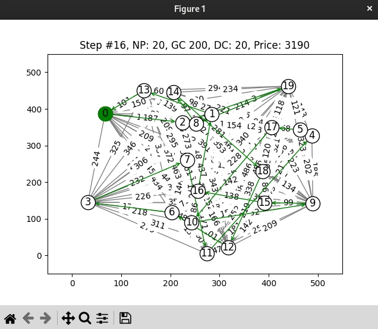
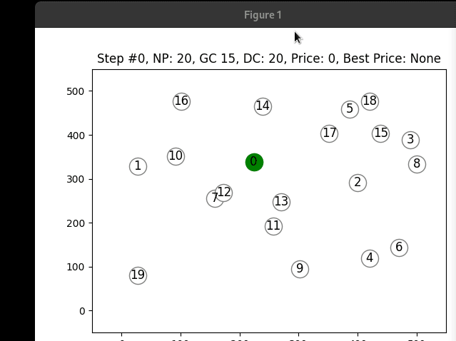

# BIA - #1 - hill-climbing

Install:

```bash
sudo ./prepare.sh -u ${USER} -p local
```

It may be needed to install dependencies for visualization libraries, etc.

Pip packages
```
pip freeze
```
out:
```
asttokens==2.0.8
backcall==0.2.0
certifi==2022.9.24
charset-normalizer==2.1.1
contourpy==1.0.5
cycler==0.11.0
decorator==5.1.1
disjoint-set==0.7.3
executing==1.1.1
fonttools==4.38.0
idna==3.4
ipython==8.5.0
jedi==0.18.1
kiwisolver==1.4.4
matplotlib==3.6.0
matplotlib-inline==0.1.6
networkx==2.8.7
numpy==1.23.4
packaging==21.3
pandas==1.5.1
parso==0.8.3
pexpect==4.8.0
pickleshare==0.7.5
Pillow==9.2.0
prompt-toolkit==3.0.31
ptyprocess==0.7.0
pure-eval==0.2.2
Pygments==2.13.0
pyparsing==3.0.9
PyQt5==5.15.7
PyQt5-Qt5==5.15.2
PyQt5-sip==12.11.0
python-dateutil==2.8.2
pytz==2022.5
requests==2.28.1
scipy==1.9.3
seaborn==0.12.1
six==1.16.0
stack-data==0.5.1
traitlets==5.5.0
urllib3==1.26.12
wcwidth==0.2.5
```

Run:

```bash
.virtenv-local/bin/python ./run-1.py
```


## 1. Hill climbing (2 body)


## 2. Simulated annealing (3 body)


## 3. Genetic algorithm used to solve Traveling Salesman Problem (TSP) (8 p)


### updated version




## 4. Differential evolution (8 p)


## 5. Particle Swarm Optimization with inertia weight (8 p)


## 6. Self-organizing Migration Algorithm - AllToOne (8 p)


## 7. And Colony Optimization applied to Travelling Salesman Problem (TSP) (8 p)




## Note:
https://github.com/vprusa/VSB-BIA/tree/devel
